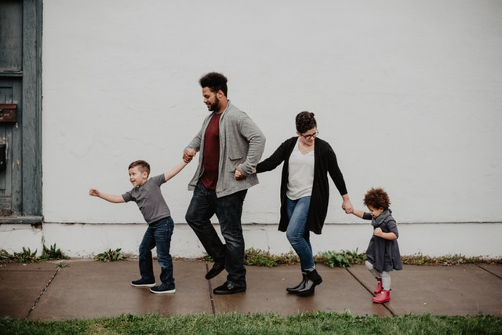

Apply a `duotone`<a href="#reference">*</a> effect to the image.

The paramters are, in order:
- `highlight color`
- `shadow color`
- `opacity` (optional)

Colors can be expressed in any [accepted format](resize.md#colors).    
If an opacity is given, an semi-transparent version of the duotone image will be composited with the
original image. This way the original colors will be visible under the tones choosen.

## Example

Without opacity
<pre><code class="hljs css html" data-preview data-previewimage="https://cvg-res.now.sh/family.jpeg">https://caravaggio.now.sh/<strong>duotone_7aff62_6b11ca</strong>/https://cvg-res.now.sh/family.jpeg</code></pre>

With opacity to 0.6
<pre><code class="hljs css html" data-preview data-previewimage="https://cvg-res.now.sh/family.jpeg">https://caravaggio.now.sh/<strong>duotone_7aff62_6b11ca_0.6</strong>/https://cvg-res.now.sh/family.jpeg</code></pre>

**Original**   

**Result**    
An opacity of 0.6 is used here, so original colors are visible:        

## Reference

This effect is borrowed by [`gatsby-plugin-sharp`](https://www.gatsbyjs.org/packages/gatsby-plugin-sharp/?=sharp) and inspired by articles like <a href="http://blog.72lions.com/blog/2015/7/7/duotone-in-js" target="_blank">`duotone in js`</a>
