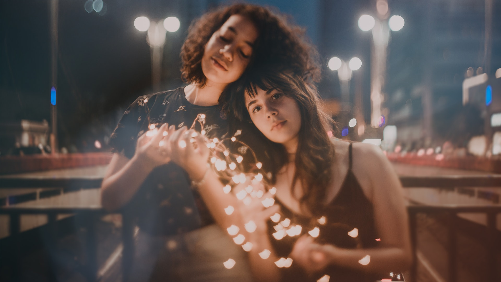
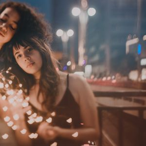
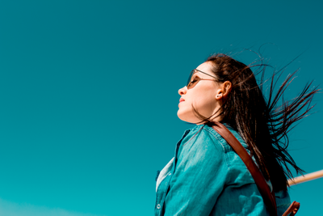
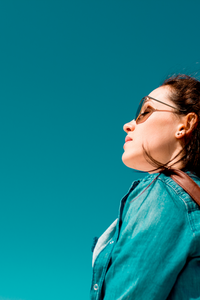
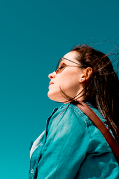
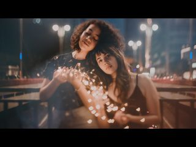
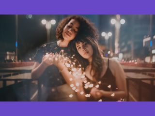

<AUTOGENERATED_TABLE_OF_CONTENTS>

Resize can be a very complex task in Caravaggio. There are plenty of ways of resizing, cropping and extract portion of your images.    
In general a resize command take this shape

**`rs_<size>_<mode>_<mode_params>`**

Where:     
__rs__ means you want change the final dimension of your image.    
__size__ is the new size (it can be expressed in several ways as explaned [here](#sizes)).    
__mode__ define how to resize. Maybe you want to stretch the image, or take just a portion;    
__mode_params__ are the parameters accepted by the specific mode and can also be empty.

## Resize methods

### Scale

In scale mode the image will have the dimension of the size you specified. The aspect ratio is kept unless you pass __iar__ (ignore aspect ratio) as additional parameter.    
Since `scale` is the default resize mode, you can avoid specifiying it.

Scale the image to 200x300 px keeping the aspect ratio    
<pre><code class="hljs css html" data-preview>http://caravaggio.host/<strong>rs_200x300</strong>/https://goo.gl/EXv4MP</code></pre>

Scale the image to 200 px width keeping the aspect ratio. The height is calculated automatically    
<pre><code class="hljs css html" data-preview>http://caravaggio.host/<strong>rs_200</strong>/https://goo.gl/EXv4MP</code></pre>

Scale the image to 200x300 px width ignoring the aspect ratio.    
<pre><code class="hljs css html" data-preview>http://caravaggio.host/<strong>rs_200x300_scale_iar</strong>/https://goo.gl/EXv4MP</code></pre>

**Original**     

**Resized**   

### Fit

The image will take the maximum available space up to the specified size, keeping the aspect ratio.    
For example this will resize the image up to 300x300 pixels and all the image will be visible.

<pre><code class="hljs css html" data-preview>http://caravaggio.host/<strong>rs_300x300_fit</strong>/https://goo.gl/EXv4MP</code></pre>

**NOTE**: both width and height must be passed. Nonetheless they can be expressed in percentage

### Down fit

Like fit but only if the image is **larger** than the desired size (width _or_ height), otherwise it will be left untouched.

<pre><code class="hljs css html" data-preview>http://caravaggio.host/<strong>rs_300x300_downfit</strong>/https://goo.gl/EXv4MP</code></pre>

**NOTE**: both width and height must be passed. Nonetheless they can be expressed in percentage

### Up fit

Like fit but only if the image is **smaller** than the desired size (__both__ the width and height must be smaller), otherwise it will be left untouched.

<pre><code class="hljs css html" data-preview>http://caravaggio.host/<strong>rs_300x300_upfit</strong>/https://goo.gl/EXv4MP</code></pre>

**NOTE**: both width and height must be passed. Nonetheless they can be expressed in percentage

### Fill

Produce a new image of specified width and height. The original image is then filled inside those dimensions. The excess part will be excluded.    
You can specify a [gravity](#gravity) to decide which part of the original image should be excluded. If nothing is specified the default gravity is `center`.

In this example we fill the image in a 300x300 px space, with gravity on the center

<pre><code class="hljs css html" data-preview>http://caravaggio.host/<strong>rs_300x300_fill</strong>/https://goo.gl/EXv4MP</code></pre>

Here instead we change the gravity to north-east

<pre><code class="hljs css html" data-preview>http://caravaggio.host/<strong>rs_300x300_fill_ne</strong>/https://goo.gl/EXv4MP</code></pre>

`Fill` also accept a special gravity parameter: **`auto`**. This let you automatically select a meaningfull region of the image.    
Here an example

Original    

Gravity on center (**rs_200x300_fill_center**)  

Gravity auto (**rs_200x300_fill_auto**)  

### Down fill

Same as fill but only if the image is larger than the target size (width _and_ height).

<pre><code class="hljs css html" data-preview>http://caravaggio.host/<strong>rs_300x300_downfill</strong>/https://goo.gl/EXv4MP</code></pre>

<pre><code class="hljs css html" data-preview>http://caravaggio.host/<strong>rs_300x300_downfill_west</strong>/https://goo.gl/EXv4MP</code></pre>

### Embed

This embeds the image in the specified dimensions. The entire image is taken and aspect ratio is kept. If the image doesn't
fit well in the dimension the output will be padded with a color of your choice (or black by default).
A [gravity](#gravity) can be specified to decide how to embed the image. Both `gravity` and `background color` are optional

<pre><code class="hljs css html" data-preview>http://caravaggio.host/<strong>rs_320x240_embed</strong>/https://goo.gl/EXv4MP</code></pre>

You can specify the color in RGB (red: 105, green: 72, blue: 200). Each number must have 3 digits, you have to pad them (so 72 must be written as 072).
<pre><code class="hljs css html" data-preview>http://caravaggio.host/<strong>rs_320x240_embed_b105072200</strong>/https://goo.gl/EXv4MP</code></pre>

The color can be specified in RGBA. To add the alpha channel value append `.n` at the end. To have full transparency put `.0`, to have full opacity put nothing, just the color.    
<pre><code class="hljs css html" data-preview>http://caravaggio.host/<strong>rs_320x240_embed_b105072200.5</strong>/https://goo.gl/EXv4MP</code></pre>

The color can be specified in hexadecimal code (6 digit). Alpha can be specified as well
<pre><code class="hljs css html" data-preview>http://caravaggio.host/<strong>rs_320x240_embed_bFF5400.5</strong>/https://goo.gl/EXv4MP</code></pre>

You can spcify the gravity     
<pre><code class="hljs css html" data-preview>http://caravaggio.host/<strong>rs_320x240_embed_bFF5400_gnorth</strong>/https://goo.gl/EXv4MP</code></pre>

## Sizes

The size parameter can be specified in several format in each resize mode. 

### Pixel

`rs_200x300` is 200 x 300 px    
`rs_200` is 200 px width, height auto    
`rs_x300` is 200 px height, width auto    

### Percentage

You can specify the width and height as percentage value of the input image

`rs_0.2x0.3` is 20% of the width and 30% of the height    
`rs_0.2` is 20% of the width    
`rs_x0.3` is 30% of the height  

### Mixed

Pixel and percentage can be mixed.

`rs_200x0.3` is 200px of width and 30% of height

## Gravity

For those operations which support gravity, those value can be specified

`center`, `north`, `northeast`, `northwest`, `east`, `west`, `south`, `southeast`, `southwest`

and can be abbreviated in 

`c`, `n`, `ne`, `nw`, `e`, `w`, `s`, `se`, `sw`.

Some operation, such as `fill` and `downfill` accept the `auto` gravity. This automatically focus on the most important region of the image. 
Look [here](#auto) for an example

## Colors

The colors accepetd by some operations can be expressed as:

RGB `120230007` in this case the rgb(120, 230, 7)

The three values of red, green and blue must be put together and each must be of three digits, so 7 becomes 007 and 45 becomes 045.

Hexadecimal `FF00AB` is in the hex format. The short notation (3 digits only) is not accepted yet and `#` at the beginning must be removed.

To specify the opacity you can add `.3` at the end. So to set an opacity of 0.4 the previouses become `120230007.4` and `FF00AB.4`    
Omitting the opacity means it is 1, full opaque, while `.0` means full transparent.
